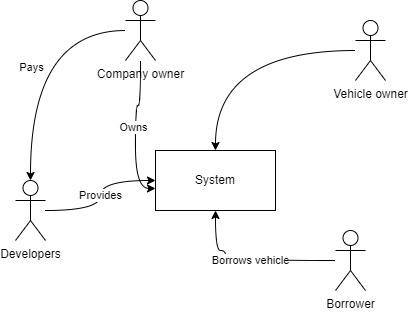

# 1. Requirements

## Functional requirements

### User stories
- Użytkownicy mogą rejestrować się w systemie.
- Użytkownicy mogą wypożyczać pojazdy w obrębie miasta.
- Obsługiwane rodzaje pojazdów: rower, hulajnoga, samochód, skuter. Lista konfigurowalna.
- Użytkownicy mogą rejestrować i udostępniać własny sprzęt. W momencie rejestracji pojazdu, użytkownik określa jaki jest
  koszt wypożyczenia sprzętu per minuta.
- Zarejestrowany użytkownik może zarówno samemu wypożyczyć czyjś sprzęt do użytku oraz wypożyczać swój sprzęt dodany do
  systemu.
- Użytkownik może wycofać sprzęt w dowolnym momencie, jeśli sprzęt nie jest w danym momencie wypożyczony przez innego użytkownika.
- Lokalizacja aktywnych klientów i sprzętu jest przesyłana do systemu w określonych interwałach - maksymalnie 1s.
- Wyszukiwanie pojazdów na mapie w pobliżu użytkownika - geosearch
- Chargowanie usera po zakończonym wypożyczeniu w zewnętrznym systemie symulującym

## Non-functional requirements (Quality attributes, constraints, ASR - architectural significant requirements)

- Wszystkie dane o trasie, wypożyczeniach i innych powinny być zapisywane w formie logów (Kafka?) do późniejszej analizy
- Wymagana wysoka przepustowość
- Skalowalność aplikacji na podstawie wybranych metryk, np. liczby aktywnych użytkowników
- Konteneryzacja wszystkich elementów systemu
- Technologie chmurowe
- NoSQL databases aby ułatwić CQRS
- CI/CD w Travis CI
- architektura mikroserwisowa w oparciu o stack Spring Boot/Spring Cloud
- komunikacja pomiędzy serwisami powinna być asynchroniczna
- Wydzielony serwer autoryzacji - Keycloack
- Konieczne jest napisanie symulatora działania systemu
- Dostawca systemu zarabia na prowizji pobieranej od wypożyczającego sprzęt - 5% z kwoty wypożyczenia.

# 2. Stakeholders

List of stakeholders in the project:

- company owner
- developers
- vehicle owner
- renter

[drawIO file](./stakeholders.drawio)
 

# 3. Stakeholders business goals

Opisywne w postaci: {stakeholder} needs to {business goal} because {reason/context}

| Stakeholder   |                     Goal                     |                                                                                                            Context |
|---------------|:--------------------------------------------:|-------------------------------------------------------------------------------------------------------------------:|
| Company owner |        Get the income from the system        |                System powinien być używany przez jak największą liczbę userów, aby zmaksymalizować przychód.   |
| Developers    |  zbudowanie szybkiego i dostępnego systemu   |           Odpowiednio działający system zbudowany zgodnie z założeniami clean code ułatwi jego rozwój i utrzymanie |
| Vehicle owner |       Możliwość udostępnienia sprzętu        | Z punktu widzenia właściciela pojazdu najważniejsza jest bezpieczeństwo sprzętu i wiedza na temat jego lokalizacji |
| Renter        | łatwo dostępny system i szybkie wypożyczanie |                                                                Szybkość wypożyczenia i dokładność naliczania opłat |

# 4 Constraints

Ograniczenia nałożone przez wymagania, aktorów tworzących system lub prawo

| Constraint                | Origin |      Type |               Context |
|---------------------------|:------:|----------:|----------------------:|
| Microservice architecture |  Dev   | Technical | CV driven development |

# 5 Quality requirements

| Requirement                                                                    |    Origin     |      Type |                                                                                                                                                              Context |
|--------------------------------------------------------------------------------|:-------------:|----------:|---------------------------------------------------------------------------------------------------------------------------------------------------------------------:|
| System services should be scalable and stateless                               |      Dev      | Technical |                                                              System powinien skalować się na podstawie liczby requestów. Z tego powodu systemy muszą być bezstanowe. |
| Możliwość obsługi 500 aktywnych sesji userów                                   | Company Owner |  Business | System powinien być w stanie obsłużyć 500 równoległych sesji userów w wersji demonstracyjnej. W wersji produkcyjnej skalowalność pozwoli na rozszerzenie możliwości. |
| Aktualizacja pozycji sprzętu oraz użytkowników w trakcie trwania podróży co 1s | Company Owner | Technical |                                                                      System powinien być w stanie obsłużyć i przechowywać historię położenia użytkowników i sprzętu. |
| Cloud ready                                                                    |      Dev      | Technical |                                                                                                                    System powinien być gotowy do wdrożenia w chmurze |

