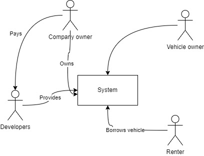

# 1. Requirements

## Functional requirements
 TODO opisać je w formie user stories oraz ASR workbooka i wybrać kluczowe dla architektury wymagania (ASR - Architectural significant requirements)
- Użytkownicy mogą wypożyczać pojazdy w obrębie miasta.
- Obsługiwane rodzaje pojazdów: rower, hulajnoga, samochód, skuter. Lista rozszerzalna.
- Użytkownicy mogą rejestrować i udostępniać własny sprzęt. W momencie rejestracji, użytkownik określa jaki jest koszt
  wypożyczenia sprzętu per minuta.
- Zarejestrowany użytkownik może zarówno samemu wypożyczyć czyjś sprzęt do użytku oraz wypożyczać swój sprzęt dodany do
  systemu.
- Dostawca systemu zarabia na prowizji pobieranej od wypożyczającego sprzęt - 5% z kwoty wypożyczenia.
- Użytkownik może wycofać sprzęt w dowolnym momencie, jeśli sprzęt nie jest w danym momencie wypożyczony.
- Lokalizacja klientów i nadajników jest przesyłana do systemu w określonych interwałach.
- Wyszukiwanie pojazdów na mapie z ograniczeniem obszaru.
- Chargowanie usera po zakończonym wypożyczeniu - +/- na konto usera. Jeśli user posiada swoje pojazdy, na jego konto
  dodawane są pieniądze otrzymane z wypożyczeń tych pojazdów.
  
## Non-functional requirements (Quality attributes, constraints)

- Wszystkie dane o trasie, wypożyczeniach i innych powinny być zapisywane w formie logów (Kafka) do późniejszej analizy
- Rozszerzalność aplikacji
- Konteneryzacja
- technologie chmurowe
- CI/CD w gitlabie

# 2. Stakeholders

List of stakeholders in the project:
- company owner
- developers
- vehicle owner
- borrower

[drawIO file](./stakeholders.drawio)
 

# 3. Stakeholders business goals

Opisywne w postaci: {stakeholder} needs to {business goal} because {reason/context}

| Stakeholder   |                     Goal                     |                                                                                                            Context |
|---------------|:--------------------------------------------:|-------------------------------------------------------------------------------------------------------------------:|
| Company owner |          Get income from the system          |                System powinien być używany przez jak największą liczbę userów, aby zmaksymalizować przychód.   |
| Developers    | zbudowanie szybkiego i przystępnego systemu  |           Odpowiednio działający system zbudowany zgodnie z założeniami clean code ułatwi jego rozwój i utrzymanie |
| Vehicle owner |       Możliwość udostępnienia sprzętu        | Z punktu widzenia właściciela pojazdu najważniejsza jest bezpieczeństwo sprzętu i wiedza na temat jego lokalizacji |
| Borrower      | łatwo dostępny system i szybkie wypożyczanie |                                                                Szybkość wypożyczenia i dokładność naliczania opłat |

# 4 Constraints

Ograniczenia nałożone przez wymagania, aktorów tworzących system lub prawo

| Constraint                | Origin |      Type | Context |
|---------------------------|:------:|----------:|--------:|
| Microservice architecture |  Dev   | Technical ||

# 5 Quality requirements

TODO

